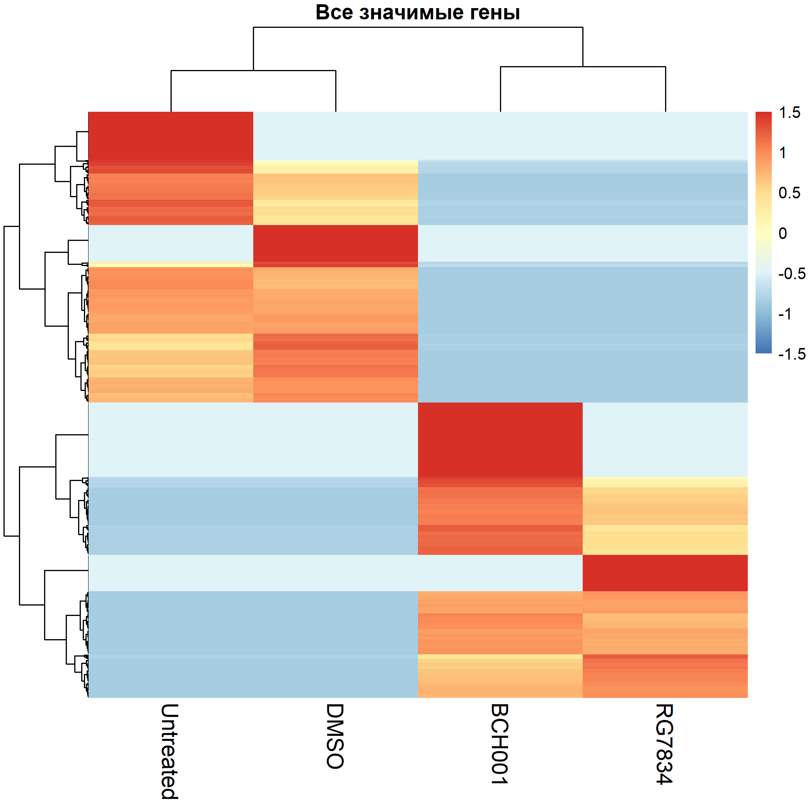

# Анализ RNA-seq: ингибиторы PAPD5 в iPSC-клетках с мутацией PARN
Нарушение стабильности РНК TERC приводит к укорочению теломер и развитию тяжёлых заболеваний, включая врождённый дискератоз и лёгочный фиброз. Одной из причин дестабилизации TERC является гиперэкспрессия PAPD5 - фермента, который деградирует эту РНК. Ингибиторы PAPD5 рассматриваются как потенциальная терапия, восстанавливающая теломеразную активность. Однако их влияние на транскриптом клеток в целом остаётся малоизученным.

Nagpal и соавторы (2020) показали, что ингибиторы PAPD5 восстанавливают уровень TERC и теломеразную активность в iPSC-клетках с мутацией PARN. Позже, в 2022 году, они опубликовали RNA-seq данные (GSE190173), которые я использовала для самостоятельного анализа.

## Цель проекта
Выявить дифференциально экспрессируемые гены в iPSC-клетках с мутацией PARN при лечении ингибиторами PAPD5 (BCH001, RG7834).

## Задачи
- провести контроль качества и очистку ридов
- выполнить квантификацию экспрессии на уровне транскриптов
- выявить транскрипты с изменённой экспрессией при лечении ингибиторами PAPD5 (BCH001 и RG7834) по сравнению с контролем
- оценить, насколько системным является транскрипционный ответ и можно ли его интерпретировать как специфический эффект ингибиторов
- визуализировать результаты (тепловая карта)

## Данные
- **GEO:** GSE190173
- **SRA:** PRJNA786214
- 4 образца: Untreated, DMSO, BCH001, RG7834 (пациент 1)

## Пайплайн
- **Контроль качества:** FastQC, MultiQC
- **Очистка:** fastp
- **Квантификация:** Salmon (был выбран в связи с ограниченными вычислительными ресурсами)
- **DE анализ:** DESeq2 (R)
- **Визуализация:** pheatmap

## Результаты
- Проанализировано 139450 транскриптов
- Выявлено 512 дифференциально экспрессируемых транскриптов (padj < 0.05), соответствующих уникальным генам
- Тепловая карта демонстрирует чёткое разделение контрольных и леченных образцов

## Инструменты
- R (DESeq2, pheatmap)
- Bash (fastp, Salmon, FastQC)
- Окружение Conda

## Файлы
- `heatmap_all_significant.pdf` — основная тепловая карта
- `significant_genes_padj0.05.csv` — полный список дифференциально экспрессируемых генов

## Примечания по ходу работы
После очистки адаптеров и обрезки по качеству, fastqc повторно выявил следующие проблемы: Per base sequence content (особенности метода секвенирования), Per sequence GC content (соответствует iPSC-клеткам), Sequence Duplication Levels (является нормой для RNA-seq), Overrepresented sequences (BLAST показал, что это регуляторные элементы генома человека (CpG-островки, сайленсеры)). На основании этих выводов работа была продолжена без дополнительных исправлений.

## Автор
e-4o7

## Источники

1. Nagpal N, Wang J, Zeng J, et al. **Small-Molecule PAPD5 Inhibitors Restore Telomerase Activity in Patient Stem Cells.** *Cell Stem Cell*. 2020;26(6):896-909.e8. doi: [10.1016/j.stem.2020.03.016](https://doi.org/10.1016/j.stem.2020.03.016). PMID: 32320679.

2. Nagpal N, et al. **Domain specific mutations in dyskerin disrupt 3' end processing of scaRNA13.** *Nucleic Acids Research*. 2022;50(18):10573-10589. doi: [10.1093/nar/gkac706](https://doi.org/10.1093/nar/gkac706). PMID: 36018809. GEO: [GSE190173](https://www.ncbi.nlm.nih.gov/geo/query/acc.cgi?acc=GSE190173).
